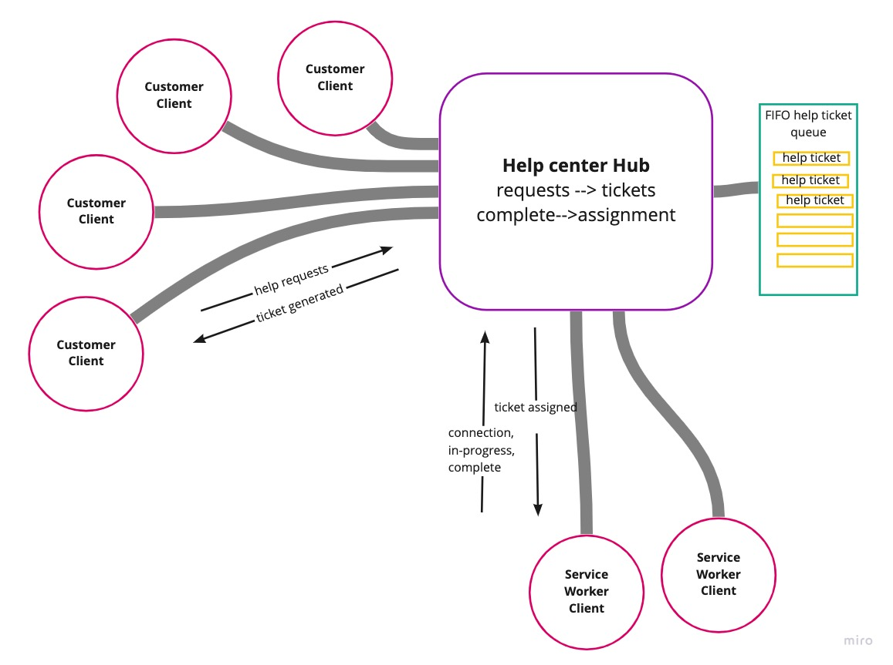

# The HelpHub 

Welcome to the Help Hub. This is a place where clients can request help for various issues and receive real-time support from service workers via "help tickets" that contain their specific request.

## Problem Domain

- Build a application with a support/service center where customers place requests for help (tickets) and service workers assist and close tickets.

## User Stories

- As a Customer, I want to request help and have a Service Worker assist me.
- As a Service Worker I want to be assigned a help ticket assigned to a Customer's id.
- As a customer, I want to alert the system when I place in a help request and a ticket has been issued to me.
- As a service worker, I want to alert the system when a "help" ticket has been requested.
- As a service worker, I want to alert the system when the "help" ticket is in progress with the customer.
- As a customer, I want to alert the system when help is in progress. 
- As a service Worker, I want to alert the system when the "help" ticket is complete.
- As a Customer, I want to be disconnected and my help ticket closed when "help" is complete.

## UML 

## Authors

**Andrew** *'I have a question'* **Enyeart**

**Jacob** *'insert clever saying here'* **Choi**

**Señor Joey** *"Call me Joey"* **Hernandez**

**Dario** *'the invisible kid'* **Vitorte**

### Deployed Server
[https://helphub-server.herokuapp.com](https://helphub-server.herokuapp.com)

### Installation

**Step One**

begin by running: 

`git clone git@github.com:aenyeart/helphub.git`

Also run this as well: 

`git clone git@github.com:aenyeart/helphub-client.git`

**Step Two**

run: `cd helphub` 
then: `npm install`

*repeat step two for 'helphub-client'*

### How to Use

**To start server**

run `npm start` 

**To test server**

run `npm run test`

### Models

**Customer**

'Customer', {
    username: string, required,
    description: string, required,
}

**Service Worker**

'Worker', {
  name: string, required,
  description: string, required,
}

**Help Ticket**

Ticket', {
  number: number, required,
  request: string, required,
  type: ('lab', 'help'), required,
}

## Features

**Help Ticket Assignment to Completion**

- When the object is passed, a help ticket is created and an emit 'Help Requested'.

- The Help Ticket is given a unique identifier (id) and an emit 'Ticket Generated'.

- The Help Ticket is then assigned to a worker who is 'Standing By' and an emit 'Assigning Ticket'.

- Help Tickets are received and logged and given an emit 'In Progress'.

- When the 'help' is complete the Help Ticket is removed from the queue and given an emit 'Complete'. Tickets are logged and closed and the Customer is disconnected from the socket.

**Error Handling**

sends a `404 error` if the route or method is unavailable.

### Testing

The testing serves to verify complete testing of the routers middleware, and the basic functionality of the help ticket console.

### Credit and Co-Conspirators

This lovely code was largely written by the immaculate **Andrew Enyeart** and **Jacob Choi**. **Joey Hernandez** dutifully provided snarky commentary and moral support, some coding, some writing (as you are reading) and, yup. 
*No one is really sure where **Dario Vitorte** is, we were thinking homing pigeons next, maybe.*
